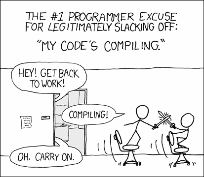

_Translated by [Francesco Tanganelli](https://twitter.com/ilTanga) <a href="..">from English</a>_

Sono un programmatore da 15 anni ormai. Recentemente la carenza di efficenza, semplicità ed eccellenza ha iniziato davvero ad infastidirmi, fino al punto di diventare depresso a causa della mia stessa carriera e dell IT in generale.

Le automobili moderne lavorano, detto per semplicità di discussione, al 98% di quanto è fisicamente possibile per un motore moderno. I palazzi moderni usano esclusivamente il materiale necessario per compiere la loro funzione e rimanere sicure sotto le condizioni necessarie. Tuttii gli aeroplani convergono verso una forma, dimensione e carico ottimali pur rimanendo sempre simili.

Solo nel software, va bene se un programma gira allo 1% o anche allo 0, 01% delle sue possibili performance. Tutti sembrano essere d’accordo con questo. Le persone sono sempre più spesso orgogliose si quanto sia inefficiente, dicendo “Perché dovrei preoccuparmi, i computer sono veloci a sufficienza”:

> [@tveastman](https://twitter.com/tveastman/status/1039002300600147968): Ho un programma in Python che lancio ogni giorno, e impiega 1,5 secondi. Ho speso 6 ore a riscriverlo da capo, ora impiega 0.06 secondi, Questa miglioria significa che recupererò il tempo investito in 41 anni e 24 giorni :-)

Avrai sicuramente già sentito questo mantra: “Il tempo dei programmatori è più costoso del tempo computazionale”. Che significa praticamente che stiamo sprecando i nostri computer su una scala senza precedenti. Compreresti una macchina che beve 100 litri per 100 chilometri? E 1000 litri? Con i computer lo stiamo facendo ogni volta.

<figure></figure>

## Tutto è insopportabilmente lento

Guardati intorno: i nostri portatili sono migliaia di volte più potenti di quelli che hanno portato l’uomo sulla Luna. Ma praticamente ogni pagina web fa fatica a mantenere una scorrevolezza fluida a 60fps sugli ultimi aggiornatissimi MacBook Pro. Posso comodamente giocare ai videogiochi, guardando video in 4K ma non riesco a scorrere le pagine web? E va bene così?

La Google inbox, una web app scritta da Google, girando su Chrome, un browser di Google, [Impiega 13 secondi ad aprire una mail di media grandezza](https://twitter.com/nikitonsky/statuses/968882438024941568):

<figure><video autoplay="" muted="" loop="" preload="auto" playsinline="" controls><source src="../inbox.mp4" type="video/mp4"></video></figure>

Inoltre mostra animazioni dentro a  quadrati vuoti invece di mostrarmi il loro contenuto perché è l’unico modo con cui può mostrare la pagina web mantenendo prestazioni decenti. No invece, perché decente non significa 60fps, ma significa piuttosto “quanto veloce una pagina web potrebbe andare . Mi viene da ridere quando vedo i commenti sul web, si risolverà quando i monitor a 120Hz saranno più diffusi.  Ma se fanno schifo già a 60hz.

Windows 10 [impiega 30 minuti a fare un aggiornamento](https://grumpy.website/post/0PeXr1S7N). Ma come è possibile che ci impieghi tanto? Mezzora è sufficiente a formattare completamente un SSD , scaricare una nuova installazione e installarla almeno 5 volte di seguito.

<figure></figure>

> [Pavel Fatin](https://pavelfatin.com/typing-with-pleasure/): Scrivere con un text editor è un processo relativamente semplice, anche i 286 erano capaci offrire una esperienza di scrittura piuttosto fluida.

I moderni text editor hanno una latenza maggiore di un Emacs di 42 anni fa. Text Editor! Cosa ci può essere di più semplice. Alla pressione di un tasti, tutto quello che devi dare è aggiornare un piccolo quadratino e un text editor moderno non riesce a farlo in meno di 16 ms. UN SACCO DI TEMPO. Un gioco 3d è in grado di riempire l’intero schermo con centinaia di migliaia di poligoni  nello stesso tempo di 16ms, e inoltre calcola gli input, ricalcola il mondo e carica e scarica dinamicamente le risorse. Come è possibile?

Un andamento generale, non stiamo rendendo il software più veloce con nuove funzionalità. Stiamo rendendo l’hardware più veloce per girare con programmi più lenti con le stesse funzionalità di prima. Tutti stanno lavorando al di sotto delle prestazioni possibili.Mi domando perché gli smartphone impieghino da 30 a 60 secondi per accendersi? Perché non possono avviarsi in, diciamo, un secondo?Non ci sono limiti fisici per questi, e vorrei vederlo veramente. Vorrei vedere il limite raggiunto ed esplorato, utilizzando fino all’ultimo bit di performance che possa darci qualcosa di significativo in modo significativo.

## Tutto è gigantesco

E poi lievita. Le web app si possono aprire 10 volte più velocemente solo disabilitano le pubblicità. Google scommette che tutti smetteranno spontaneamente  di combattersi l’un l’altro semplicemente usando le AMP, (Accelerated Mobile Page), una soluzione tecnologica ad un problema che non richiede nulla di tecnologico, solo un pò di buon senso. Se rimuovi il superfluo, le pagine diventano incredibilmente veloci. É tanto difficile da capire?

Il sistema operativo Android, senza app installate, [richiede quasi 6 Gb](https://grumpy.website/post/0Oz1lDOq5). Pensate solo per un secondo a quanto è esagerata questa cifra.
Che c’è dentro, film in HD?  Scommetto che ci sarà in pratica solo del codice: il kernel e dirvers. Qualche stringa in più, e le risorse per funzionare , certamente, ma quanto possono essere grandi? Quindi, ma di quanti driver ha bisogno un telefono per funzionare?

<figure></figure>

Windows 95 era 30MB. Oggi alcune pagine web pesano più di così, Windows 10 è 4 gb. cioè+ 133 volte più grande. Ma è anche 133 volte superiore?  Cioè le funzionalità sono più o meno le solite, Si c’è coreana, ma dubito che sia 3970Mb. Ma comunque vada per Windows10, Android lo è il 150%?

La tastiera di Google gira un processo che mangia 150 Mb. Una app che disegna 30 caratteri sullo schermo può davvero essere 5 volte più complessa di tutto Windows95? Google App, che non è altro che un pacchetto per Google Web Search è 350 Mb. Google Play Services, che non uso (non compro libri, musica o video da lì) è 300 Mb che se ne stanno li e non sono in grado di eliminare.

<figure></figure>

Tutto questo mi lascia circa 1Gb per le mie foto dopo aver installato le app essenziali (i social, le chat, le mappe, il servizio taxi, l’homebanking etc. E questo, senza nemmeno aver installato nè giochi, nè musica. Vi ricordate quanto il sistema operativo, tutte le applicazioni e i vostri dati stavano su di un floppy?

Il vostro assistente desktop ToDoList è scritto probabilmente in Electron è quindi contiene al suo interno [i driver per i controller della Xbox360](https://josephg.com/blog/electron-is-flash-for-the-desktop/), può renderizzare grafica 3d e riprodurre audio, oltre che scattare foto con la vostra webcam.

<figure></figure>

Una semplice chat testuale è famosa per il suo consumo di risorse. Si, dovete contare Slack come una applicazione ad alto uso di risorse. Significa, che una chatroom e un semplicissimo text editor, che dovrebbero essere le applicazioni più semplici del mondo. Benvenuti nel 2018.

Ma almeno funzionano, direte. Bene, Grosso non vuole dire anche migliore. Più grande significa che qualcuno ha perso il controllo. Più grande significa che non sappiamo cosa sta succedendo. Più grande significa costi di complessità, di performance, di affidabilità. Questo non è corretto e non deve diventare la norma. Applicazioni “sovrappeso” dovrebbero essere espulse. Dovrebbero andarsene via impaurite.

## Tutto marcisce

Un telefono da 16 giga Android era perfetto fino a 3 anni fa. Oggi con Android 8.1 è a malapena utilizzabile perché ogni app è diventata almeno il doppio di prima e senza un motivo apparente.
Non ci sono funzionalità aggiuntive, non sono più veloci o meglio ottimizzate. non sembrano differenti. Cos’è, sono solo.. cresciute?

Iphone 4s è stato rilasciato con iOs5, ma riesce a malapena a girare con iOS 9. E non perché iOS 9 sia superiore, è praticamente la stessa cosa. Ma i loro nuovi hardware sono più veloci, e quindi possono fare software più lenti. Nessun problema, abbiamo una nuova innovazione qua, possiamo girare le stesse app di prima, alla stessa velocità! Io davvero non capisco.

iOS 11 ha eliminato il supporto per le app a 32 bit, che significa che se lo sviluppatore che non era nei dintorni al tempo dell’uscita di  iOS 11 o semplicemente che non impazzisce per tornare ad aggiornare una applicazione perfettamente funzionante, voi non avrete più possibilità di vedere la sua app funzionare. Mai più.

> @[jckarter](https://twitter.com/jckarter/statuses/1017071794245623808): Un programma DOS può girare praticamente senza modifiche su qualsiasi computer costruito dal 1980 a ora. Una applicazione java potrebbe essere danneggiata dal prossimo  aggiornamento di Chrome.

Le pagine web in funzione oggi potrebbero non essere più compatibili [con nessun browser entro 10 anni](http://tonsky.me/blog/chrome-intervention/), (forse prima).

“Devi correre quanto più possibile,  per restare nello stesso posto” Ma qual’è il punto?  Mi posso anche divertire a comprare un nuovo telefono e un nuovo MacBook tanto quanto chiunque., ma dovrei farlo esclusivamente per essere in grado di far girare le stesse applicazione di prima che sono solo diventate più lente?

Io penso che si possa fare e si debba fare meglio di così. Tutti sono impegnati a progettare cose in questo momento da usare subito, oggi , raramente per domani. Ma sarebbe meglio avere cose che durino un pò più di così.

## Peggio è meglio

Non ci capisce niente nessuno a questo punto. Nemmeno quelli che vogliono farlo. Noi siamo semplicemente al di fuori di tutto questo, sperando per il meglio e chiamandolo “Incantesimo”.

Le pagine web che ti chiedono di ricaricare quando non funzionano. Chi ha il tempo di capire cosa è successo realmente.

<figure></figure>

Qualsiasi web app produce un costante flusso di errori JS causali anche in browser compatibili.

L’intera architettura delle pagine Web/SQL è costruita sulla premessa (e sulla speranza) che nessuno tocchi i tuoi dati mentre gli stai mostrando a video.

Le richieste di intervento all’utente sono “al meglio dì” e hanno moltissimi casi nel quotidiano di perdita di dati. Avete mai visto la schermata “Quale versione tenere?” Significa, che l’asticella è talmente bassa che l’utente potrebbe essere contento di vedere una schermata di questo tipo.

<figure></figure>

E nel mio mondo non vanno bene le applicazioni che ti dicono “Distruggerò parte del tuo lavoro, ma tu puoi scegliere quale”.

Linux ferma i processi a caso volutamente, ed è il miglior sistema operativo lato server.

Ogni apparecchio che possiedo fallisce regolarmente in un modo o nell’altro. Il mio monitor Dell necessita di un riavvio ogni tanto perché lo richiede il software al suo interno. Airdrop? Sei fortunato se riesce a trovarti e connettersi, o in alternativa, cosa c’è? Il bluetooth? Le specifiche sono così complesse che gli apparecchi [non vogliono parlano tra di loro](https://thewirecutter.com/blog/understanding-bluetooth-pairing-problems/) e [spesso il reset](http://time.com/4358533/bluetooth-fix-how/) è l’unica cosa che si possa fare.

<figure></figure>

E non ho ancora toccato [Internet of Things](https://twitter.com/internetofshit). Da quanto fa ridere la situazione non so nemmeno cosa aggiungere.

Io vorrei essere orgoglioso del mio lavoro. Voglio consegnare prodotti stabili e che funzionano. Per farlo, dobbiamo capire cosa stiamo costruendo, dentro e fuori, e non è possibile farlo in un sistema super ingegnerizzato e pompato come questo.

## Programmare è sempre lo stesso schifo

Sembra proprio che a nessuno interessi costruire prodotti basilari di qualità, veloci, efficienti, durevoli. Nemmeno quando le soluzioni le conosciamo già da molti anni, continuiamo a sbattere negli stessi problemi: gestione dei pacchetti, costruire sistemi, compilatori, tipi di linguaggio, interfacce IDE.

I nostri sistemi sono intrinsecamente inaffidabili e richiedono una completa pulizia ogni tanto. Nulla ci vieta dal creare un processo di produzione affidabile, che sia prevedibile, e 100% riproducibile. Solo che nessuno sembra importante. NPM è rimasto nello stato di “A volte funziona” per anni.

> [@przemyslawdabek](https://twitter.com/przemyslawdabek/status/940547268729606145): Lo fa solo a me che `rm -rf node_module` sia una parte necessaria nello sviluppo di progetti in Note.js/Javascript?

E i tempi di compilazione? Sembra che nessuno pensi che aspettare minuti o ore per compilare sia un problema. Dove è finito “il tempo dei programmatori è più importante” Quasi tutti i compilerà, pre e post processor, aggiungono costi in termini di tempo, a volte disastrosi senza nemmeno aggiungere benefici di alcun tipo.

<figure></figure>

Ti aspetteresti che su questo aspetto  i programmato prendano le decisioni più razionali, ma spesso fanno esattamente l’opposto. Ad esempio scegliendo Apache Hadoop [anche se è più lento che gestire lo stesso problema su un desktop singolo](https://www.chrisstucchio.com/blog/2013/hadoop_hatred.html).

Machine learning e l’intelligenza artificiale stanno spostando il confine in cui la maggioranza dei computer non sarà nemmeno più in grado di gestire le richieste.

> [@rakhim](https://twitter.com/freetonik/status/1039826129190875136): Quando una app o un server è descritta come AI_powered, o ML-Based, io ci leggo: inaffidabile, imprevedibile e impossibile capirne il comportamento. Cerco sempre di evitare l’AI perché voglio computer che siano il contrario, cioè affidabili, prevedibili e ragionevoli.

Mettiamo macchine virtuali dentro linux, e poi mettiamo Docker dentro queste macchine virtuali, semplicemente perché nessuno è capace di pulire lo schifo che producono un programma fatto male, il linguaggio stesso e l’ambiente di produzione che sta usando. Nascondiamo la polvere sotto al tappeto solo perché non vogliamo averci a che fare. Single binari è ancora un ENORME chiave del successo per le app in linguaggio Go, Niente schivo == successo.

<figure></figure>

E le dipendenze? Le persone aggiungono tranquillamente pacchetti di soluzioni tutto incluso super ingegnerizzate per risolvere i problemi più semplici senza considerarne i costi.
E queste dipendente portano ad altre dipendenze. Si finisce con avere un albero di dipendenze tale che sembra di essere tra una storia dell’orrore (o mio dio, è enorme e pieno di conflitti) e una commedia (non ci sono ragioni per includere questa roba, [ma intanto eccola qua](https://medium.com/@jdan/i-peeked-into-my-node-modules-directory-and-you-wont-believe-what-happened-next-b89f63d21558)).

<figure></figure>

I programmi non possono funzionare per anni senza riavviarli. A volte [anche alcuni giorni](https://docs.gitlab.com/ee/administration/operations/unicorn.html#unicorn-worker-killer) sembra chiedere troppo. Succedono cose a caso e nessuno sa perché.

Ma quel che è peggio è che nessuno ha il tempo per fermarsi e cercare di capire cosa sta succedendo. Perché sbattersi se puoi fregartene. Avvia un altra istanza su AWS, riavvia il processo. Cancella e ripristina l’intero database. Scrivi un Watchdog che riavvii la tua app guasta ogni 20 minuti. Includi [pure risorse più e più volte](https://blog.timac.org/2017/0410-analysis-of-the-facebook-app-for-ios-v-87-0/). Continua a muoverti veloce, senza riparare nulla.

Questa non è ingegneria. Questa è programmazione pigra.  L’ingegneria cerca di capire le performance, le strutture, i limiti di cosa stai costruendo, profondamente. Combianre codice scritto male con altra roba scritta anche peggio va fortemente contro a questa idea. Per migliorare, dobbiamo capire cosa e perché lo stiamo facendo.

## Siamo bloccati

Così tutto è solo un mucchio di codice a malapena funzionante aggiunto sopra una montagna di codice a mala pena funzionante. E continua a crescere in volume e complessità, diminuendo ogni possibilità di cambiare.

Per avere un ecosistema in salute tu devi tornare indietro e rivedere tutto. Si deve a volte prendere tutto, buttare via e sostituire con cose migliori.

<figure></figure>

Ma chi è che ha il tempo di farlo? Non vediamo un kernel di OS nuovo da quanto , 25 anni? È diventato semplicemente troppo complesso per riscriverlo da capo. I browser sono talmente pieni di problemi noti e casi limite da risolvere che a nessuno importa di riscrivere i motori da zero.

La definizione di progresso oggi è più o meno gettare altra benzina sul fuoco:

> [@sahrizv](https://twitter.com/sahrizv/status/1018184792611827712): 2014: dobbiamo adottare i microservices per risolvere i problemi della programmazione monolitica. 2016: dobbiamo adottare Docker per risolvere i problemi dei micro servizi 2018: dobbiamo usare kubernetes per risolvere i problemi di Docker

Oppure reinventare la ruota:

> [@dr_c0d3](https://twitter.com/dr_c0d3/status/1040092903052378112): 2000: Scrivvi centinaia di linee di XML per configurare i tuoi servlet e EJB.  2018: Scrivi centinaia di linee in YAML per configurare i tuoi micro servizi Almeno XML aveva uno schema...

Siamo bloccati con quello che abbiamo, e nessuno ci salverà.

## Gli affari non contano

E nemmeno gli utenti lo faranno. Loro ormai hanno imparato ad aspettarsi quel che facciamo noi. Gli ingegneri (NOI) dicono che ogni app per Android deve essere 350Mb? Ok. Possono conviverci. Noi diciamo che non può essere più fluido? Ok, vivranno con telefonia ch sei bloccano. Diciamo, Se non funziona, riavvia? Riavvieranno. Dopo tutto non è una loro scelta.

Non c’è concorrenza in questo. Tutti costruiscono gli stessi prodotti lenti, bloccati, gonfiati e non efficienti. A volta si fa un salto avanti di qualità che porta dei vantaggi in termini di competizione. (iPhone/iOS vs gli atri smartphone, Chrome vs gli altri browser) e costringe tutti a cambiare, ma non per molto.

Così la nostra missione quanto ingegneri è di mostrare al mondo cosa sia possibile fare con i computer di oggi in termini di performance, affidabilità, qualità e usabilità. Se ci interessa, le persone impareranno. E non c’è nessun altro tranne noi che possiamo mostragli che questo è realmente possibile. Ma solo se ci interessa veramente.

## Non è tutto uno schifo

Ci sono alcuni punti limpidi che ci indicando che migliorarci oltre lo stato dell’arte non + impossibile.

Il lavoro che ha fatto [Martin Thompson](https://twitter.com/mjpt777) è impressionante, semplicemente rinfrescante ed efficiente ([LMAX Disruptor](https://github.com/LMAX-Exchange/disruptor), [SBE](https://github.com/real-logic/simple-binary-encoding), [Aeron](https://github.com/real-logic/aeron)).

[Xi editor](https://github.com/google/xi-editor) di Ralph Levien sembra costruito con i giusti principi in mente.

[Jonathan Blow](https://www.youtube.com/user/jblow888) ha un linguaggio che si è sviluppato da solo per i suoi giochi che compila 500 mila laiche di codice al secondo su un portatile. Compilazione reale, senza cache intermedia, o build incrementali.

Non devi essere un genio per scrivere programmi veloci. Non ci sono trucchi o giochi di prestigio. C’è solo una cosa, non costruire sopra a una enorme montagna di rifiuti quali sono gli strumenti moderni che usiamo.

## Manifesto per un mondo migliore

Voglio vedere i progressi, Voglio cambiare. Voglio uno stato dell’arte nell’ingegneria del software da migliorare, non rimanere fermi. Non voglio reinventare sempre le stesse cose ogni volta, meno performanti e più grosse ogni volta. Voglio qualcosa in cui credere, un obbiettivo che sia degno, un futuro migliore di quel che abbiamo oggi, e Oglio che la comunità degli ingegneri condivida questa visione.

Quel che abbiamo oggi non è progresso. A mala pena rispondiamo agli obbiettivi lavorativi con pochi strumenti applicati uno sull’altro. Siamo bloccati in una visione locale, e nessuno si vuole muovere. Non è nemmeno un bel posto, è saturo e inefficiente. Siamo solo abituati a questa condizione.

Mi voglio chiamare fuori: dove siamo oggi è una schifezza. Come ingegneri, possiamo e dobbiamo progettare meglio e lo faremo meglio. Possiamo avere strumenti migliori, fare applicazioni migliori, più veloci, più stabili, più affidabili, usando meno risorse (diversi ordini di grandezza meno!!) Dobbiamo capire profondamente dove stiamo andando e perché. Dobbiamo consegnare: affidabile, prevedibile, con la massima qualità. Possiamo e dobbiamo essere orgogliosi del nostro lavoro. Non solo “con quello che avevo..."—senza se e senza ma!

Spero di non essere solo a pensarla così. Spero che ci siano persone la fuori che vogliono la stessa cosa. Apprezzerei se almeno iniziassimo a pensare a quanto è assurdamente brutta la situazione attuale nell’industria del software. E almeno provare ad immaginare come poterne venire fuori.