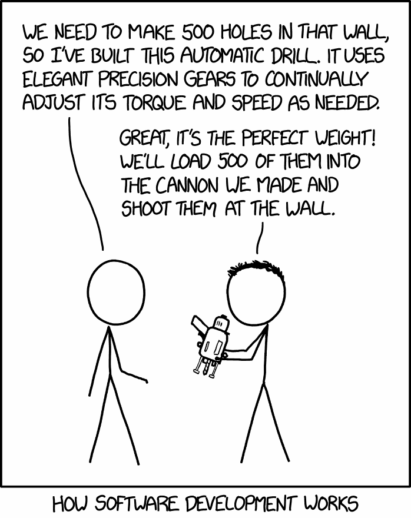
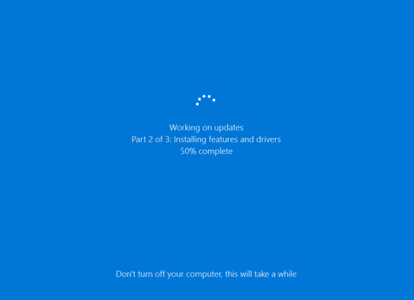
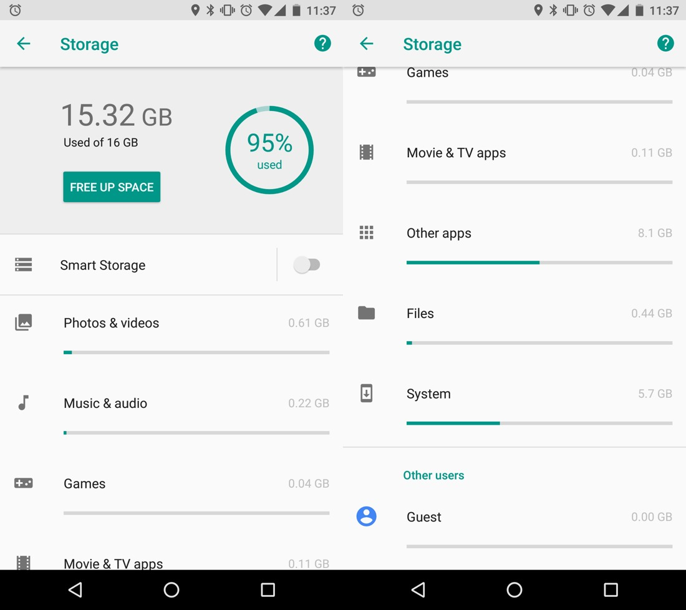
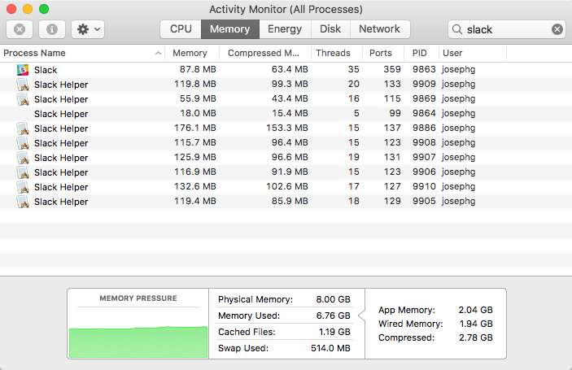
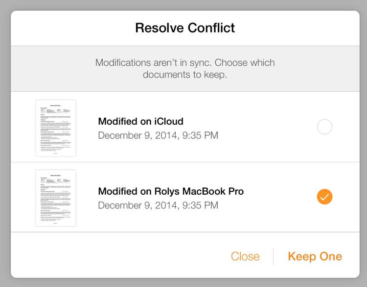
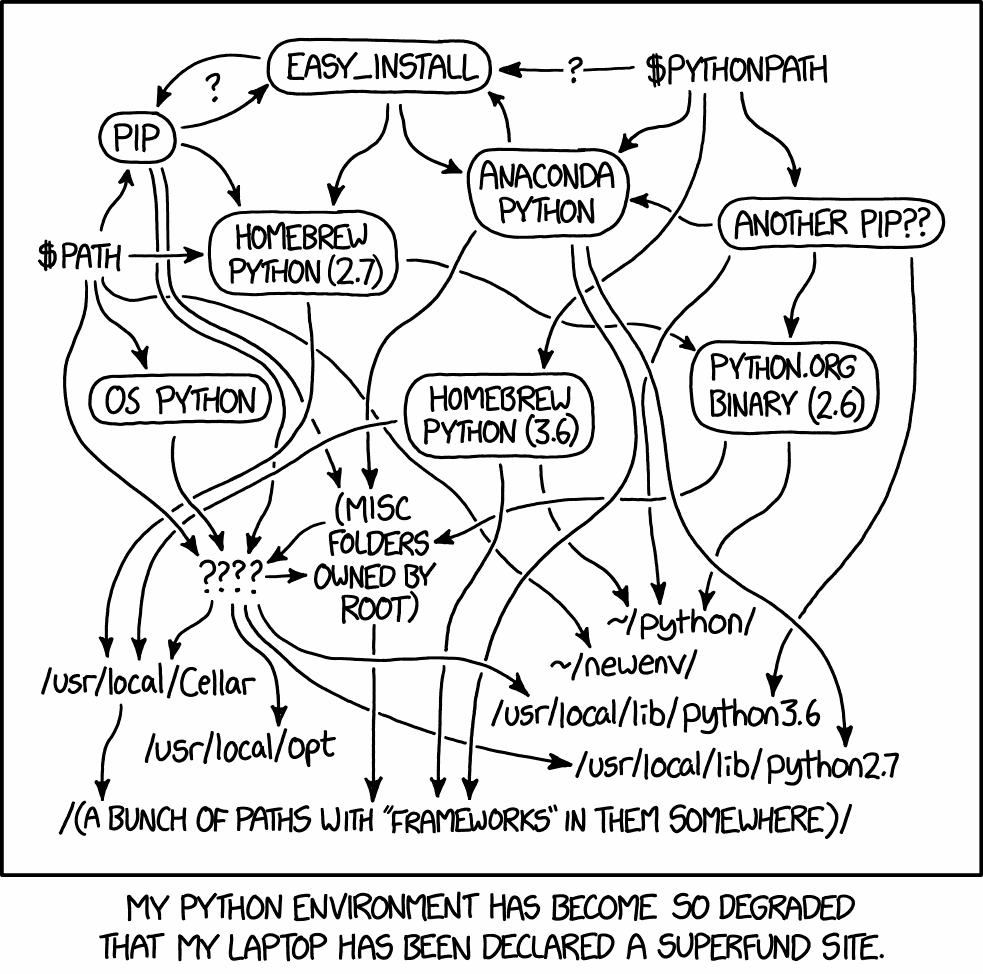
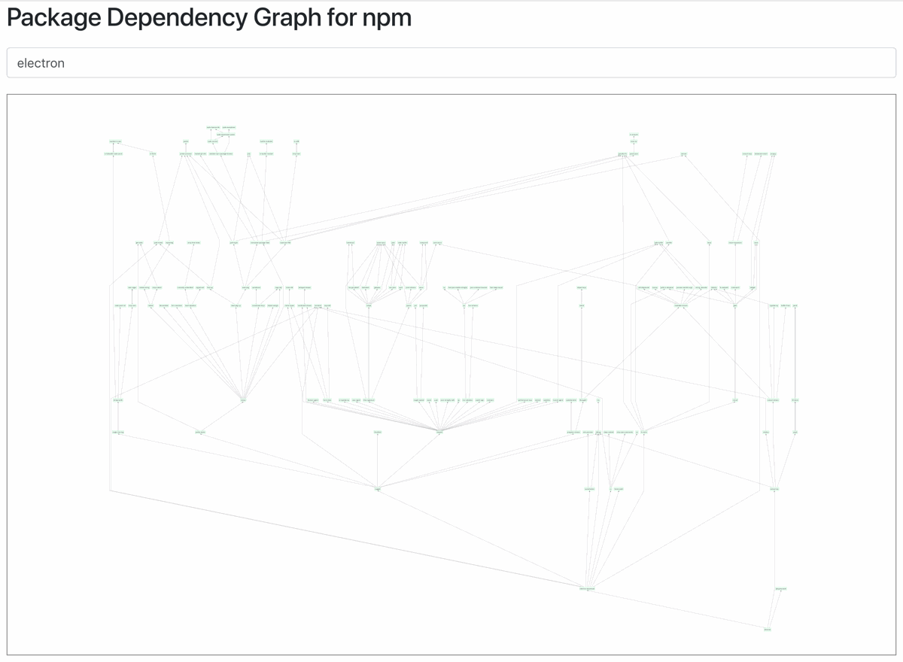

_Перевод <a href="..">с английского</a> от <a href="https://habr.com/en/post/423889/">@m1rko</a>._

Я занимаюсь программированием уже 15 лет. Но в последнее время при разработке не принято думать об эффективности, простоте и совершенстве: вплоть до того, что мне становится грустно за свою карьеру и за IT-отрасль в целом.

Для примера, современные автомобили работают, скажем, на 98% от того, что физически позволяет нынешняя конструкция двигателя. Современная архитектура использует точно рассчитанное количество материала, чтобы выполнять свою функцию и оставаться в безопасности в данных условиях. Все самолёты сошлись к оптимальному размеру/форме/нагрузке и в основном выглядят одинаково.

Только в программном обеспечении считается нормальным, если программа работает на уровне 1% или даже 0,01% от возможной производительности. Ни у кого вроде нет возражений. Люди даже гордятся, насколько неэффективно работает программа, типа «зачем беспокоиться, компьютеры достаточно быстрые»:

> [@tveastman](https://twitter.com/tveastman/status/1039002300600147968): Я каждый день запускаю программу на Python, она выполняется за 1,5 секунды. Я потратил шесть часов и переписал её на Rust, теперь она выполняется за 0,06 секунды. Это ускорение означает, что моё время окупится через 41 год, 24 дня :-)

Наверное, вы слышали такую мантру: «Время программиста дороже времени компьютера». Это означает, что мы тратим компьютерное время в беспрецедентных масштабах. Вы бы купили машину с расходом 100 литров на 100 километров? Как насчёт 1000 литров? С компьютерами такое происходит постоянно.

<figure>
  
Суть разработки программного обеспечения: 
— Нужно проделать 500 отверстий в стене, так что я сконструировал автоматическую дрель. В ней используются элегантные точные шестерни для непрерывной регулировки скорости и крутящего момента по мере необходимости. 
— Отлично, у неё идеальный вес. Загрузим 500 таких дрелей в пушку, которые мы сделали, и выстрелим в стену. 
</figure>

## Всё невыносимо медленно

Оглянитесь вокруг: портативные компьютеры в тысячи раз мощнее тех, что привели человека на Луну. Тем не менее, каждый второй сайт не может обеспечить плавную прокрутку страницы на 60 FPS на последнем топовом MacBook Pro. Я могу комфортно играть в игры, смотреть видео 4K, но не прокручивать веб-страницы! Это нормально?

Почтовому приложению Google Inbox в браузере Chrome от той же Google, [требуется 13 секунд, чтобы открыть письмо среднего размера](https://twitter.com/nikitonsky/statuses/968882438024941568):

<figure><video autoplay="" muted="" loop="" preload="auto" playsinline="" controls><source src="../inbox.mp4" type="video/mp4"></video></figure>

Он ещё анимирует пустые белые формы вместо того, чтобы показать их содержимое, потому что это единственный способ анимировать что-то на веб-странице с приличной производительностью. Нет, не 60 FPS, а скорее «настолько быстро, насколько возможно на этой странице». С нетерпением жду, что же веб-сообщество предложит, когда дисплеи 120 Гц станут мейнстримом. Они еле справляются с 60 Гц.

Обновление Windows 10 [занимает 30 минут](https://grumpy.website/post/0PeXr1S7N). Что можно делать так долго? Этого времени достаточно, чтобы полностью отформатировать мой SSD-накопитель, загрузить свежий билд и установить его примерно 5 раз подряд.

<figure></figure>

> [Pavel Fatin](https://pavelfatin.com/typing-with-pleasure/): Набор текста в редакторе — относительно простой процесс, поэтому даже 286 могли обеспечить довольно плавный процесс набора.

В современных текстовых редакторах задержка при наборе больше, чем в 42-летнем Emacs. Текстовые редакторы! Что может быть проще? На каждое нажатие клавиши, нужно всего лишь обновить крошечную прямоугольную область на экране, а современные текстовые редакторы не могут сделать это за 16 мс. А это много времени. МНОГО. 3D-игра заполняет экран сотнями тысяч (!!!) полигонов за те же 16 мс, а также обрабатывает ввод, пересчитывает мир и динамически загружает/выгружает ресурсы. Как так?

Тенденция такова, что софт вовсе не становится быстрее и функциональнее. Мы получаем более быстрое оборудование, на котором софт с теми же функциями ворочается медленнее, чем раньше. Всё работает намного медленнее максимальной скорости. Никогда не задумывались, почему ваш телефон загружается от 30 до 60 секунд? Почему он не может загрузиться, скажем, за одну секунду? Здесь нет никаких физических ограничений. Лично мне бы такое понравилось. Хочется, чтобы разработчики достигли предела, используя каждый бит для производительности.

## Всё ОГРОМНОЕ

И ещё это раздутие. Веб-приложения могут открываться в десять раз быстрее, если просто заблокировать рекламу. Google умоляет всех прекратить тормоза с помощью инициативы AMP — технического решения, для которого не нужны какие-либо технологии, просто немного здравого смысла. Если удалить раздувание, интернет станет работать на сумасшедшей скорости. Неужели это сложно понять?

Система Android без приложений [занимает почти 6 ГБ](https://grumpy.website/post/0Oz1lDOq5). Просто задумайтесь на секунду, насколько неприлично огромное это число. Что там, фильмы в HD-качестве? Думаю, в основном код: ядро, драйверы. Ещё какие-то ресурсы, конечно, но они не могут быть такими большими. Сколько же драйверов вам нужно для телефона?

<figure></figure>

Windows 95 занимала 30 МБ. Сегодня у нас есть веб-страницы тяжелее, чем эта ОС! Windows 10 уже 4 ГБ, то есть в 133 раза больше. Но разве она в 133 раза лучше? Я имею в виду, функционально они практически одинаковы. Да, у нас появилась Кортана, но я сомневаюсь, что она весит 3970 МБ. Но это Windows 10, неужели Android должен быть ещё в полтора раза больше?

Приложение клавиатуры Google как ни в чём не бывало съедает 150 МБ. Эта программа рисует 30 клавиш на экране — она правда в пять раз сложнее, чем вся Windows 95? Приложение Google app, в основном, просто пакет для Google Web Search, занимает 350 МБ! Сервисы Google Play, которыми я не пользуюсь (я не покупаю там книги, музыку или видео) — 300 МБ, которые просто сидят здесь и которые нельзя удалить.

<figure></figure>

После установки всех необходимых приложений (социальные сети, чаты, карты, такси, банки и т. д.) на телефоне остался всего 1 гигабайт для фотографий. И это вообще без игр и музыки! Помните времена, когда ОС, приложения и все ваши данные помещались на дискету?

Ваша программа для заметок наверняка написана в Electron и, таким образом, [поставляется с драйвером для контроллера Xbox 360](https://josephg.com/blog/electron-is-flash-for-the-desktop/), умеет показывать 3D-графику, воспроизводить аудио и фотографировать с помощью веб-камеры.

<figure></figure>

Простой текстовый чат всегда славился скоростью и малым потреблением памяти. Так что Slack — это пример очень ресурсоёмкого приложения. Я имею в виду, что чат и текстовый редактор — это самые базовые вещи, они должны потреблять меньше всего ресурсов. Добро пожаловать в 2018 год.

Вы можете сказать, что они хотя бы работают. Но увеличение размера — не значит улучшение. Это значит, что кто-то потерял контроль. Мы больше не знаем, что происходит. Увеличение размера — это повышение сложности, снижение производительности и надёжности. Это ненормально и не должно считаться нормой. На раздутый размер нужно сразу обращать внимание — и держаться от них подальше.

## Всё гниёт

Android-телефон на 16 ГБ был прекрасен три года назад. Сегодня под Android 8.1 он еле работает, потому что каждое приложение увеличилось минимум вдвое без видимых причин. Дополнительных функций нет. Они не стали быстрее и внешний вид не изменился. Они просто… раздулись?

iPhone 4s вышел с iOS 5, но едва может работать под управлением iOS 9. И это не потому, что iOS 9 намного лучше — в основном, система не изменилась. Но новое оборудование быстрее, поэтому они сделали программное обеспечение медленнее. Не волнуйтесь — вы получили захватывающие новые возможности, например… работа тех же приложений с той же скоростью! Не знаю.

iOS 11 прекратила поддержку 32-разрядных приложений. Это значит, что если разработчик не готов вернуться и обновить приложение, скорее всего, вы не увидите снова эту отличную программу.

> @[jckarter](https://twitter.com/jckarter/statuses/1017071794245623808): Программу DOS можно заставить работать без изменений практически на любом компьютере, сделанном после 80-х годов. Приложение JavaScript может прекратить работу из-за завтрашнего обновления Chrome.

Сегодняшние веб-страницы [не будут работать в любом браузере через 10 лет](http://tonsky.me/blog/chrome-intervention/) (а может и раньше).

«Нужно бежать со всех ног, чтобы только остаться на том же месте». Но смысл? Я могу постоянно покупать новые телефоны и ноутбуки, как все, но делать это лишь ради того, чтобы иметь возможность запускать все те же приложения, которые стали только медленнее?

Думаю, что мы можем и должны исправить ситуацию. Сейчас все разрабатывают программы для сегодняшнего дня, изредка для завтрашнего. Но будет неплохо делать вещи, которые работают немного дольше.

## Хуже — значит лучше

Сейчас никто ничего не понимает. И не хочет понимать. Мы просто выпускаем полусырую ерунду, надеемся на лучшее и называем это «здравым смыслом для стартапа».

Веб-страницы просят обновиться, если что-то пошло не так. У кого есть время, чтобы найти причину неполадки?

<figure></figure>

Любое веб-приложение выдаёт постоянный поток «случайных» ошибок JS, даже на совместимых браузерах.

Вся архитектура баз данных веб/SQL построена на предпосылке (даже надежде), что никто не изменит данные, пока вы смотрите на открытую веб-страницу.

Большинство приложений для совместной работы сделали «как смогли», там масса типичных сценариев, когда они теряют данные. Видели диалог «Какую версию сохранить?» Сегодня планка так низка, что пользователи рады даже этому вопросу.

<figure></figure>

И нет, в моём мире не является нормальным приложение, которое говорит: «Я уничтожу часть твоей работы, только выбери какую».

Linux намеренно убивает случайные процессы. И всё же это самая популярная серверная ОС.

У меня каждое устройство регулярно выходит из строя так или иначе. Время от времени монитор Dell нужно аппаратно перезагружать, потому что в нём есть софт. AirDrop? Вам повезёт, если он обнаружит устройство, иначе что делать? Bluetooth? Спецификации настолько сложны, что устройства [не будут устанавливать связь друг с другом](https://thewirecutter.com/blog/understanding-bluetooth-pairing-problems/), а периодические перезагрузки — [оптимальный вариант](http://time.com/4358533/bluetooth-fix-how/).

<figure></figure>

И я даже не упоминаю об [Интернете вещей](https://twitter.com/internetofshit). Это настолько за гранью разумного, что даже нечего добавить.

Я хочу гордиться своей работой. Я хочу делать рабочие, стабильные вещи. Для этого нужно понять, что конкретно мы разрабатываем, внутри и снаружи, а это невозможно сделать в раздутых, чрезмерно усложнённых системах.

## В программировании такой же хаос

Кажется, что никто больше не заинтересован в качественных, быстрых, эффективных, долговечных, основательных решениях. Даже если давно известны эффективные решения, мы по-прежнему боремся с теми же проблемами: управление пакетами, системы сборки, компиляторы, конструкция языка, IDE.

Системы сборки по своей сути ненадёжны и периодически требуют полной очистки, хотя у них есть вся информация для инвалидации. Ничто не мешает сделать процесс сборки надёжным, предсказуемым и на 100% воспроизводимым. Просто никто не думает, что это важно. NPM уже много лет находится в состоянии «иногда работает».

> [@przemyslawdabek](https://twitter.com/przemyslawdabek/status/940547268729606145): Кажется, что rm-rf node_modules является неотъемлемой частью рабочего процесса в проектах Node.js/JavaScript.

А время сборки? Никто не считает проблемой, что компилятор работает минуты или даже часы. А как же «время программиста дороже»? Почти все компиляторы, пре- и постпроцессоры значительно, иногда катастрофически увеличивают время сборки, не обеспечивая пропорционально существенных преимуществ.

<figure></figure>

Вы ожидаете, что программисты будут принимать в основном рациональные решения, но иногда они делают прямо противоположное. Например, выбирая Hadoop [даже если он медленнее, чем выполнение той же задачи на одном десктопном компьютере](https://www.chrisstucchio.com/blog/2013/hadoop_hatred.html).

Машинное обучение и ИИ отбросили программное обеспечение к гаданию на кофейной гуще во времена, когда большинство компьютеров даже не были достаточно надёжными.

> [@rakhim](https://twitter.com/freetonik/status/1039826129190875136): Когда приложение или сервис говорит «под управлением ИИ» или «на основе машинного обучения», я читаю это как «ненадёжное, непредсказуемое поведение, которое не поддаётся объяснению». Я держусь подальше от «ИИ», потому что хочу от компьютеров противоположного: надёжности, предсказуемости и логики.

Мы засунули виртуальные машины в Linux, а затем засунули Docker в виртуальные машины, просто потому что никто не смог разобраться с бардаком, который производят большинство программ, языков и их окружений. Мы накрываем дерьмо одеялами, чтобы не убирать его. Например, «единый бинарник» остаётся ОГРОМНЫМ преимуществом Go. Нет бардака == успех.

<figure>
  
  Окружающая среда Python настолько загрязнилась, что мой ноутбук объявили зоной экологической катастрофы.
</figure>

А зависимости? Люди бездумно ставят переусложнённые «полные пакеты» для простейших проблем, не думая о последствиях. Из этих зависимостей растут новые. В конечном итоге вы получаете дерево, которое является чем-то средним между фильмом ужасов (огромное и полное конфликтов) и комедией (нет причин, по которым мы добавили сюда эти пакеты, [но вот они](https://medium.com/@jdan/i-peeked-into-my-node-modules-directory-and-you-wont-believe-what-happened-next-b89f63d21558)):

<figure></figure>

Программы не могут работать несколько лет без перезагрузки. Иногда [даже несколько дней — это слишком](https://docs.gitlab.com/ee/administration/operations/unicorn.html#unicorn-worker-killer). Происходят случайные глюки, и никто не знает почему.

Что ещё хуже, ни у кого нет времени остановиться и выяснить, что произошло. Зачем беспокоиться, если всегда есть другой выход. Поднять новый инстанс AWS. Перезапустить процесс. Удалить и восстановить базу данных. Написать скрипт, который будет перезапускать ваше сломанное приложение каждые 20 минут. [Включить одни и те же ресурсы несколько раз: тяп-ляп — и в продакшн](https://blog.timac.org/2017/0410-analysis-of-the-facebook-app-for-ios-v-87-0/). Двигайся быстро, не трать время на исправление ошибок.

Это не инженерная работа. Это просто ленивое программирование. Инженерная работа предполагает глубокое понимание производительности, структуры и ограничений того, что вы создаёте. Лепить халтуру из некачественного материала — совершенно противоположное занятие. Чтобы развиваться, мы должны понимать, что и зачем мы делаем.

## Мы застряли

Таким образом, всё это просто куча едва работающего кода, добавленного поверх ранее написанного едва работающего кода. Он продолжает расти в размерах и сложности, уменьшая шансы на изменения.

Чтобы иметь здоровую экосистему, необходимо вернуться. Необходимо иногда выбрасывать хлам и заменять его лучшими альтернативами.

<figure></figure>

Но у кого есть на это время? Новые ядра ОС не выходили сколько, 25 лет? Это сейчас стало слишком сложным, чтобы просто взять и переписать. В браузерах накопилось столько пограничных ситуаций и исторических прецедентов, что никто не осмелится писать движок с нуля.

Сегодняшнее определение прогресса — или подбросить топлива:

> [@sahrizv](https://twitter.com/sahrizv/status/1018184792611827712): 2014 — нужно внедрить микросервисы для решения проблем с монолитами. 2016 — нужно внедрить Docker, чтобы решить проблемы с микросервисами.
 2018 — нужно внедрить Kubernetes, чтобы решить проблемы с Docker.

или изобретать велосипед:

> [@dr_c0d3](https://twitter.com/dr_c0d3/status/1040092903052378112): 2000: напишите 100 строк XML, чтобы «декларативно» настроить сервлеты и EJB. 2018: напишите 100 строк YAML, чтобы «декларативно» настроить микросервисы. В XML были хотя бы схемы…

Мы застряли, и никто нас не спасёт.

## Бизнесу всё равно

Пользователям тоже. Они выучились принимать то, что мы делаем. Мы (инженеры) говорим, что каждое приложение для Android занимает 350 МБ? Хорошо, они будут с этим жить. Мы говорим, что не можем обеспечить плавную прокрутку? Окей, они свыкнутся с телефоном, который подтормаживает. Мы говорим: «Если не работает, перезагрузитесь»? Они перезагрузятся. Ведь у них нет выбора.

Конкуренции тоже нет. Все строят одни и те же медленные, раздутые, ненадёжные продукты. Случайный скачок вперёд по качеству даёт конкурентное преимущество (iPhone/iOS против других смартфонов, Chrome против других браузеров) и заставляет всех перегруппироваться, но ненадолго.

Наша миссия как инженеров — показать миру потрясающие возможности современных компьютеров с точки зрения производительности, надёжности, качества и удобства использования. Если нам не всё равно, люди потянутся. И никто кроме нас не покажет им, что такое возможно. Если только нам не наплевать.

## Не всё так плохо

Иногда на пасмурном небосводе просвечивают лучики надежды.

Работа [Мартина Томпсона](https://twitter.com/mjpt777) ([LMAX Disruptor](https://github.com/LMAX-Exchange/disruptor), [SBE](https://github.com/real-logic/simple-binary-encoding), [Aeron](https://github.com/real-logic/aeron)) впечатляет, она освежающе проста и эффективна.

[Редактор Xi](https://github.com/google/xi-editor) Рафа Левиена, кажется, построен на правильных принципах.

[Джонатан Блоу](https://www.youtube.com/user/jblow888) для своей игры разработал язык компилирования, который компилирует 500 000 строк в секунду на ноутбуке. Это холодная компиляция, никакого промежуточного кэширования, никаких инкрементальных билдов.

Не нужно быть гением, чтобы писать быстрые программы. Здесь нет какой-то магии. Единственное, что требуется, — это не строить софт на базе огромной кучи дерьма, которую поставляют современные инструменты.

## Манифест лучшего мира

Я хочу видеть прогресс. Я хочу перемен. Чтобы современное программное обеспечение совершенствовалось, а не стояло на месте. Я не желаю заново изобретать одно и то же, каждый раз выпуская всё более медленный и раздутый продукт. Я хочу во что-то верить — в достойную цель, в будущее, которое лучше, чем то, что мы имеем сегодня, и чтобы появилось сообщество инженеров, которые разделяют это видение.

Что мы имеем сегодня — это не прогресс. Мы едва достигаем бизнес-целей с этими плохими инструментами. Мы застряли в локальном оптимуме, и никто не хочет двигаться. Это даже не хорошее место, оно раздутое и неэффективное. Мы просто как-то привыкли к нему.

Поэтому я хочу заявить: нынешняя ситуация — полное дерьмо. Как инженеры, мы можем и должны, и сделаем лучше. У нас могут быть лучшие инструменты, мы можем создавать лучшие приложения, более быстрые, предсказуемые, более надёжные, использующие меньше ресурсов (на порядки меньше!). Мы должны глубоко понять, что мы делаем и почему. Мы должны выпускать продукты надёжно, предсказуемо, с самым высоким качеством. Мы можем и должны гордиться нашей работой. Не просто «учитывая то, что у нас было...» — никаких оговорок!

Надеюсь, я не одинок. Надеюсь, что есть люди, которые хотят того же. Я буду рад, если мы хотя бы начнём говорить о том, насколько абсурдно нелепа нынешняя ситуация в индустрии программного обеспечения. А потом, возможно, придумаем, как выбраться из неё.