Я расскажу о построении веб-приложений со сложным интерфейсом.

Под сложными я понимаю интерактивные страницы и приложения, у которых на экране одновременно развивается более одного сценария.

В чем проблема сложных интерфейсов? Их сложность растет нелинейно относительно количества фич. Подход «разделяй и властвуй» работает плохо, потому что человек ожидает от интерфейса адекватности, контекстности, уместности — а это значит, что фичи начинают переплетаться между собой и влиять друг на друга.

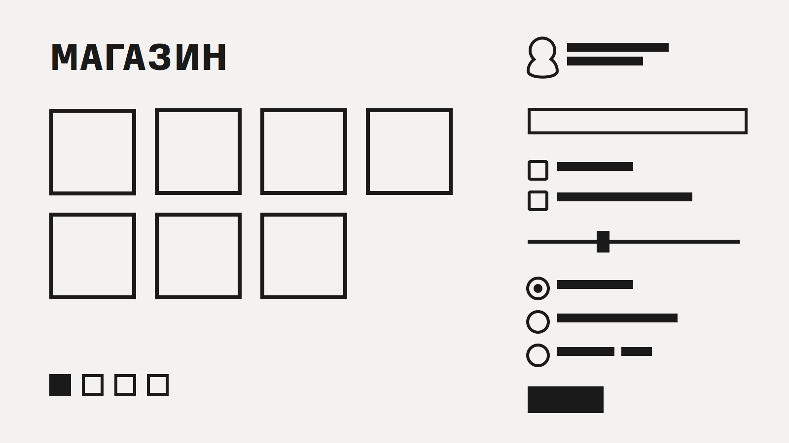

Объясню на пальцах: мы делаем магазин и сделали рубрику товаров (первый компонент). Если мы теперь добавим форму фильтрации, очевидно, что содержимое рубрики должно меняться в зависимости от того, что там введено. Но верно и обратное: содержимое рубрики влияет на поведение формы. Если у нас в рубрике всего 10 товаров, нужно фильтр скрывать. Если все товары синие, можно убрать параметр «цвет» из фильтра. Потом мы добавляем возможность залогиниться (третий компонент) и выясняется, что залогиненному пользователю надо рисовать в каталоге звездочки для отмеченной одежды, а также применить скидки и пересортировать по цене. Пагинатору надо учиться помнить свое положение при манипуляциях с формой поиска. И так далее.

Каждый новый компонент влияет на предыдущие, и предыдущие нетривиально связываются с новым. Для неинтерактивного приложения это еще как-то можно учесть — как минимум, условия игры фиксированы на момент рендеринга страницы. Но у нас же приложение! Новые товары могут прилететь на страницу по аяксу. Пользователь может накликать «никогда не показывать мне это, это и это». Через 5 минут страница ничего общего не будет иметь с тем, как она выглядела на момент загрузки. И все это надо адекватно отрисовывать.

Получается, что каждый компонент это не просто поле ввода и ячейка в модели. Его внешний вид определяется предысторией (как, где и сколько в него тыкали) и окружением (как вообще выглядит приложение, какой контекст вокруг).

По-хорошему тут надо еще рассмотреть промежуточные состояния, обработку ошибок, координацию (эффективное централизованное общение с сервером, например), анимации, тестирование. Так и получается, что там, где в бэкенде — три поля в табличке и сгенерированные фреймворком заглушки, на фронте — 3000+ строк тайного знания.

Собственно, это и есть постановка проблемы. С ростом количества фич в интерфейсе сложность кода растет нелинейно. Сложность здесь не алгоритмическая, не оптимизационная даже, а просто сложность в количестве комбинаций, сложность управления информацией. Поэтому даже некоторые формы поиска по магазину можно считать сложными интерфейсами. Чтобы такие интерфейсы поднимать, одного наития недостаточно, нужны средства кардинального упрощения разработки. О них мы и поговорим.

И еще одна ремарка. В докладе заявлено «веб»-программирование, однако сами подходы универсальны и сильно важнее, чем конкретные названия библиотек. Так что даже если вы не пишете под веб, вам это может быть интересно.

## Ликбез по ФП

Что я понимаю под функциональным программированием? Это зонтичный термин, возникший спонтанно и исторически, точного определения у него нет.

В простейшем, минимально-обязательном смысле функциональным называют язык, в котором есть функции высшего порядка и замыкания. Сегодня это джентльменский набор, стыдно не уметь, подключились даже Java и C++11. В _таком_ смысле JavaScript, конечно, исконно-функциональный язык — там всегда только так и программировали.

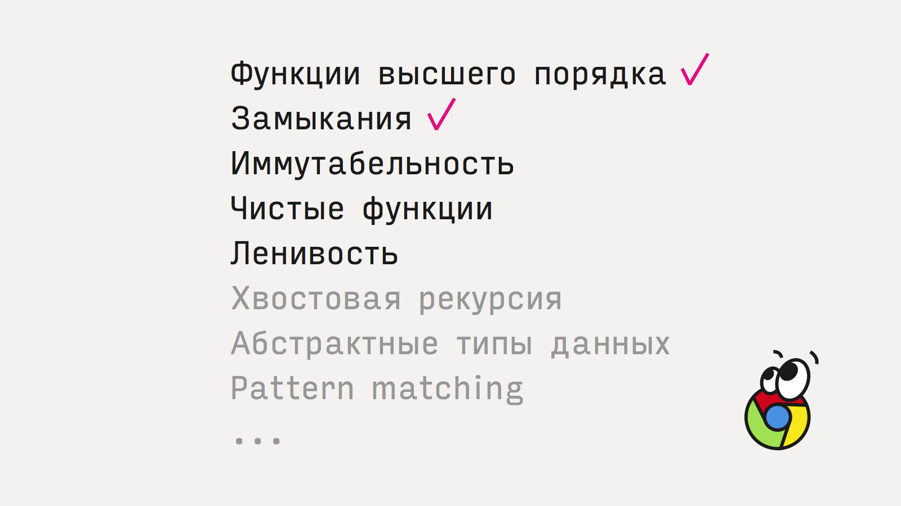

Нас будут интересовать три других аспекта, тоже причисляемые к ФП: иммутабельные данные, чистые функции и ленивость. Остальные аспекты — хвостовую рекурсию, паттерн-матчинг и алгебраические типы данных — мы пропустим.

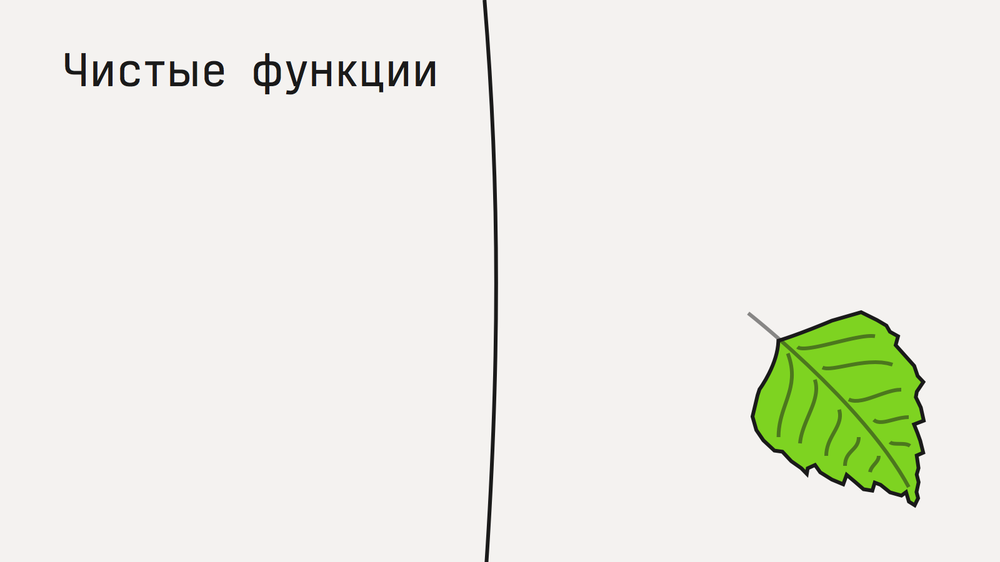

Проще всего объяснить чистые функции. Чистые функции не производят никаких наблюдаемых побочных эффектов, только возвращают результат. Не меняют глобальных переменных, ничего никуда не посылают и не печатают, не трогают объектов, и так далее. Принимают данные, что-то вычисляют, учитывая только аргументы, и возвращают новые данные.

В ФП чистые функции стараются использовать по-максимуму. Плюсы:

- Легче читать и понимать код
- Легче тестировать (не надо создавать «условий»)
- Надежнее, потому что не зависят от «погоды» и состояния окружения, только от аргументов
- Можно запускать параллельно, можно кешировать результат

Чтобы использовать чистые функции, нужны дисциплина, понимание преимуществ, привычка. Технических средств почти никаких не нужно, за исключением, может быть, иммутабельных коллекций.

Иммутабельные структуры данных: списки, словари, множества — это коллекции, которые нельзя изменить. Примерно как числа. Число просто есть, его нельзя поменять. Также и иммутабельный массив — он такой, каким его создали, и всегда таким будет. Если нужно добавить элемент — придется создать новый массив.

Преимущества неизменяемых структур:

- Безопасно разделять ссылку между потоками
- Легко тестировать
- Легко отследить жизненный цикл (соответствует data flow)

Иммутабельные структуры данных критически важны в функциональном программировании, без них чистые функции не могли бы работать с коллекциями, ведь добавление элемента в коллекцию — это сайд-эффект.

Есть один подвох, о котором вы, возможно, уже задумались. Наивная реализация иммутабельных коллекций (даже copy-on-write) была бы жутко неэффективной, поэтому используются оптимизации, в частности, структурное переиспользование.

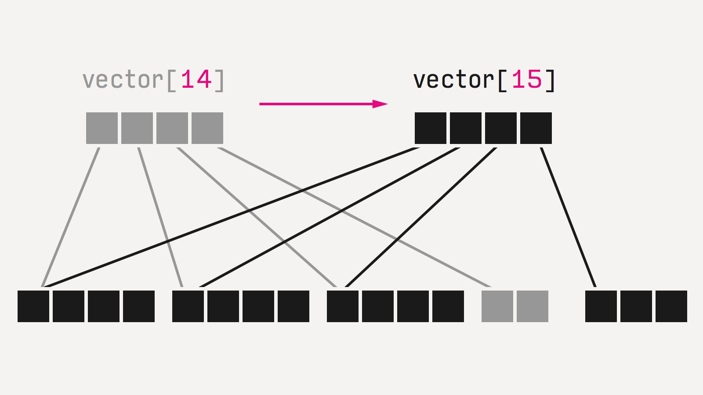

Все структуры реализованы как деревья, и при изменении одного из листов пересоздается только одна ветка, а все остальные используются напрямую по ссылкам из старого дерева. Такие структуры называются персистентыми (просто термин, ничего общего с сохранением на диск).

Естественно, это не даром. Скорость часто ниже. Если совсем грубо, то на небольших объемах, на типовых операциях (добавить элемент, поискать элемент) персистентные структуры примерно в 2 раза дороже. В большинстве случаев это _несущественная разница_.

Давайте договоримся, что цифры производительности я привожу наобум, из каких-то конкретных случаев, на тех реализациях, которые я видел, возможно даже, из конкретных частных случаев из моего опыта. Поэтому воспринимайте их с долей скептицизма и не полагайтесь в каких-то своих расчетах, а лучше меряйте сами. (конечно, я понимаю, что если кто-то на докладе говорит «в 2 раза медленнее», даже с таким количеством оговорок, как у меня, все запомнят только эту цифру и всегда будут на нее ссылаться).

Впрочем, есть и обратная сторона. Некоторые задачи решаются эффективнее: например, создать большой vector (10k элементов) уже на 30% быстрее, чем js array, потому что реаллокаций меньше (опять же, тест мой, неформальный, из подвернувшейся под руку задачи).

Еще одно важное свойство: за счет переиспользования структуры хранить N копий, которые были построены одна из другой (например, все предыдущие версии) гораздо эффективнее, чем наивно копировать обычные массивы и словари. К примеру, в goya (пиксельный редактор) хранение 100 фреймов истории (холст 64×64 пикселя) обошлось на порядок дешевле, чем хранение полных копий. Эта разница в эффективности хранения — часто — как раз _существенна_.

Наконец, ленивость. Прием очень простой: вместо того, чтобы посчитать и передавать готовые данные, мы оперируем функциями, которые эти данные вычислят по запросу. Одно из применений — представление бесконечных структур (например, список всех натуральных чисел можно так сделать), другое — оптимизация вычислений. Функция может сказать «вот мой результат», хотя на самом деле ничего не сделать, только сгенерировать замыкание, которое результат может вычислить. Вызывающая сторона по необходимости вызовет эту функцию или не вызовет.

Итак, наконец мы можем поговорить о том, как это применять.

Традиционно интерфейс — это одно большое дерево вложенных объектов — окон, кнопок, прямоугольников — которые в произвольном порядке хаотично меняются, чтобы отразить переходы состояний. В вебе это стандартно DOM-дерево:

Давайте представим, что DOM-дерево неизменяемо. Тогда все переходы между состояниями можно выразить чистыми функциями:

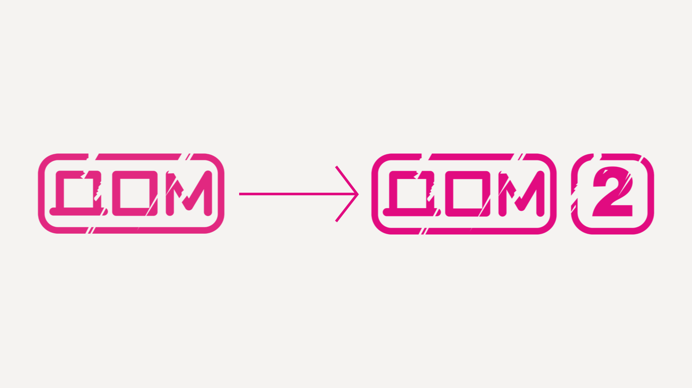

Уже неплохо, потому что дает как минимум тестируемость — захотели посмотреть, как прячется окошко, создали DOM с окошком, вызвали DOM² = hideWindow(DOM), проверили что в DOM² окошка уже не видно.

У этого подхода есть проблема нелинейного роста сложности. Если у нас N состояний интерфейса, нужно реализовать N² переходов:

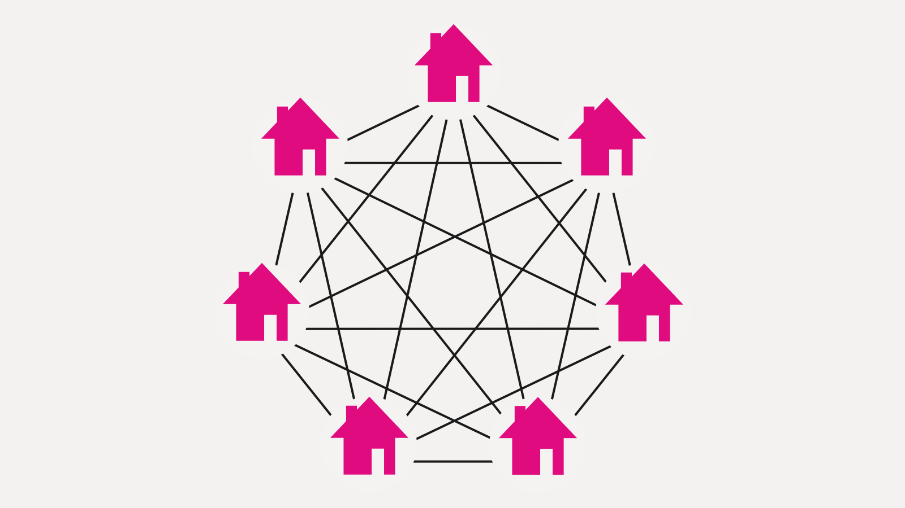

Проблема решается выделением модели:

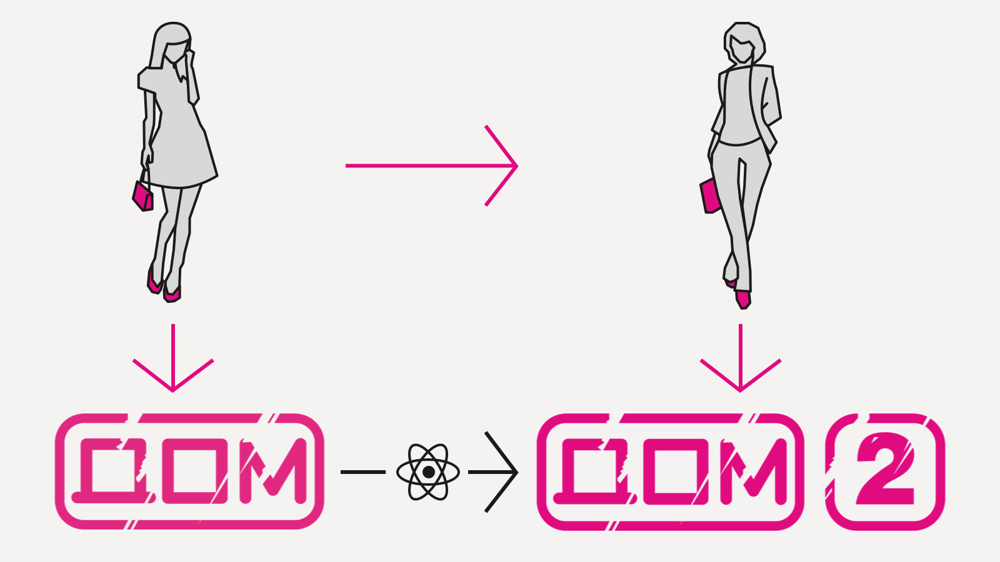

Мы реализуем (чистыми функциями, разумеется) только render: Model → DOM (плюс переход между моделями, но он, как правило, принципиально проще), а конверсию DOM → DOM² берет на себя библиотека. Так работает фэйсбуковский react.js и другие virtual DOM реализации. Вместо развесистых и сложных мутаций DOM мы пишем одну функцию, которая вычисляет DOM с нуля, хоть каждый кадр, на основе только входных данных — в данном случае, модели.

Может показаться, что это дороже чем мутации — да, но не существенно, как показал успех React, это работает достаточно быстро, чтобы делать 60 FPS интерфейсы и обгонять Angular.

Самое важное, что такой подход снимает головную боль по мутации DOM (превращая квадратичную зависимость по количеству рендер-кода в линейную) и открывает возможности для высокоуровневых оптимизаций.

Самая очевидная — ленивость. Куски нового дерева можно не вычислять, если вычислены куски старого (мемоизация!), их рендеринг это чистая функция и входные параметры не изменились. В React это по-умолчанию выключено, но там, где вы можете дать такие гарантии, это можно частично включить (см. shouldComponentUpdate).

Иметь чистую функцию рендеринга удобно и по другой причине: можно внезапно показать любую модель. Это означает, что что бы мы ни подсунули рендерингу, он это отрисует. Сильно упрощает:

- Рендеринг превью (спекулятивный, «что если?»)
- Ренедринг истории (как выглядело на модели, которая была шаг назад?)
- Тестирование (привести UI в заданное состояние)

Также явное разделение состояния (модель) и поведения (чистые функции) позволяет делать горячее обновление кода, что очень важно для интерактивной разработки.

Теперь давайте посмотрим, что получится, если сделать модель иммутабельной?

Впервые идею сделать модель персистентной <a href="http://swannodette.github.io/2013/12/17/the-future-of-javascript-mvcs/">предложил</a> David Nolen, мейнтейнер ClojureScript, в библиотеке Om. Он заметил, что таким образом мы получаем почти даром две вещи: undo/redo стек и эффективную ленивость.

Чтобы сделать undo/redo, мы просто сохраняем ссылки на все состояния модели. Поскольку они иммутабельные, а функция рендеринга чистая, мы можем на любую модель в любой момент переключиться.

Например, в пиксельном редакторе Goya весь код undo/redo занимает 10 строк, буквально:

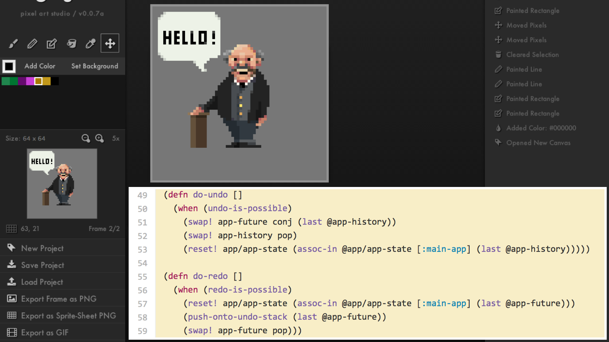

А вот ленивость, как я ее объяснял для React-а, с иммутабельными данными можно включить везде и сделать это эффективно. Как вы помните, в иммутабельных структурах данных нельзя сделать inplace модификацию, а значит, чтобы определить, были ли изменения, не нужно делать глубокое сравнение. Это позволяет быстро реализовать shouldComponentUpdate в React простым сравнением ссылок и эффективно отсекать целые ветки компонентов, если мы видим, что аргумент рендер-функции не поменялся.

Итак, давайте взглянем на архитектуру еще раз:

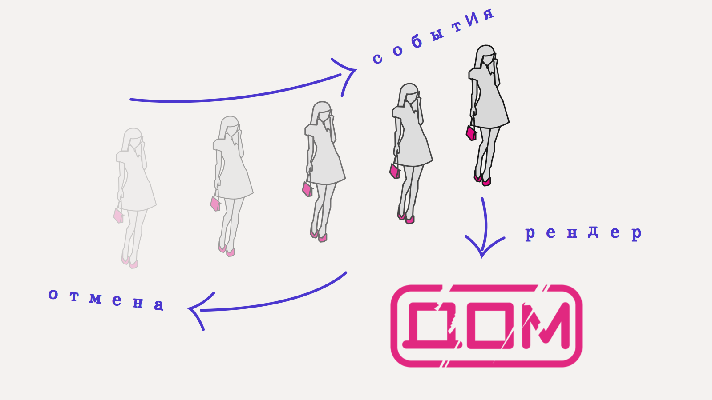

- копим историю изменений модели
- пишем функцию рендеринга из модели в virtual DOM
- переключаемся между моделям и получаем undo/redo
- эффективное хранение истории
- получаем превьюшки (спекулятивный рендеринг)
- легко юнит-тестировать

Рендеринг при этом ленивый, поскольку он сравнивает иммутабельные модели между собой, он может очень эффективно отсечь целые куски DOM-дерева, просто сравнив указатели на данные, от которых они зависят.

Дальше можно с этой архитектурой делать разные вариации, насколько фантазия позволяет.

Можно <a href="http://blog.circleci.com/local-state-global-concerns/">сериализовать всю модель в строку</a> и переслать по почте. Потом вставить ее и получить в точности то же состояние интерфейса:

<iframe class="slide" width="800" height="600" src="https://www.youtube.com/embed/5yHFTN-_mOo" frameborder="0" allowfullscreen></iframe>

Можно локально кешировать модель в localStorage и рендерить ее сразу, параллельно ходить на сервер за свежей, по приходу переключаться.

С сохраненной историей модели, помимо undo/redo, можно работать как с источником данных. Можно делать по ней запросы, например: поле ввода автодополняет то, что пользователь в него уже вводил.

Можно синхронизировать историю на сервер — тогда при загрузке страницы вы сможете отменить последнее действие, которое сделали, может быть, два года назад.

Вот пример event sourcing архитектуры, над которой я сейчас работаю:

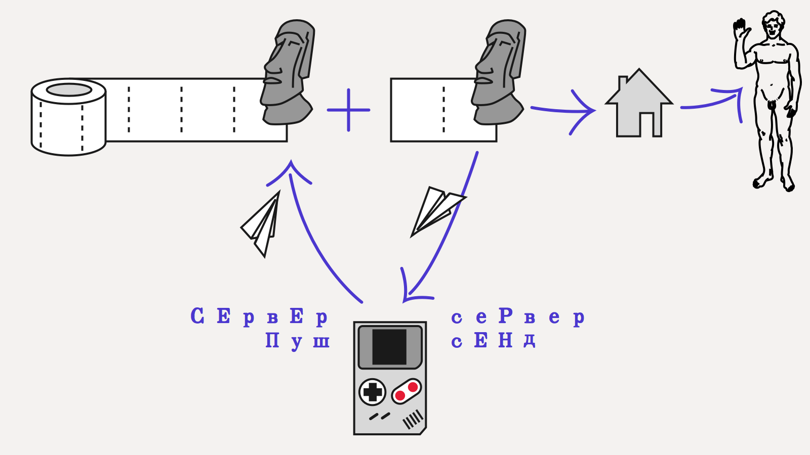

Тут используется свойство иммутабельности модели. Лог событий делится на две части: подтвержденный сервером и локальный оптимистичный. Приложение хранит две модели: насчитанную только по подтвержденному сервером логу, и текущую оптимистичную модель. Когда пользователь что-то нажимает и генерирует таким образом событие, оно сразу же попадает в оптимистичный лог и обновляет локальную модель. Эта модель используется для рендеринга интерфейса, на все действия пользователь получает немедленную обратную связь, даже если соединения с сервером нет. Параллельно фоновый процесс пытается синхронизировать локальные события с сервером. Когда это удается, сервер присылает какой-то ответ. Вне зависимости от содержимого, локальная модель выбрасывается, и события применяются поверх последней подтвержденной модели. В простейшем случае сервер просто подтвердит все события пользователя, таким образом мы получим в точности такую же модель, как та, на которую смотрит пользователь. С точки зрения интерфейса ничего не произойдет.

Красота этого подхода в том, что он позволяет прозрачно обрабатывать конфликты. По сути, никаких конфликтов и нет: если у сервера свой взгляд на очередность событий, клиент просто согласится с ней. Если в лог вплелись события других пользователей, то они точно так же вплетутся в локальный лог.

Elm использует иммутабельность для реализации фич еще более фантастических: у них <a href="http://debug.elm-lang.org">есть time-travelling debugger</a>:

<iframe class="slide" width="800" height="450" src="https://www.youtube.com/embed/zybahE0aQqA" frameborder="0" allowfullscreen></iframe>

Если ты видишь, что что-то сломалось, не беда — можно отмотать назад и посмотреть, как оно там было. Можно даже поменять код в середине дебага и посмотреть, как оно бы сложилось, если бы он сразу был такой.

Это возможно благодаря простым вещам, о которых мы только что говорили: чистоте, иммутабельности состояния и сохранения истории всех событий. Если вы именно так построили архитектуру приложения, вы можете и у себя собрать подобное.

## Практические советы

Давайте теперь перейдем к практической части доклада. Более-менее практических реализаций описанной архитектуры я знаю две.

Первая — это ClojureScript. Это диалект Clojure с компиляцией в JS, Clojure это в свою очередь современный диалект Лиспа, только функциональный, с упором на хороший interop и практичность. Сам язык предлагает персистентные структуры данных, очень хорошие — из него потом их везде порастащили.

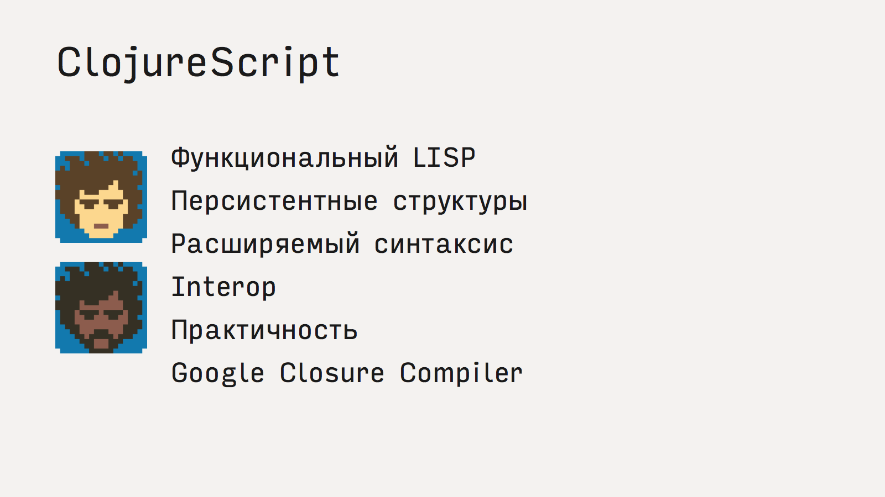

Описанная архитектура реализуется в ClojureScript на React-based фреймворках Om, Quiescent, Reagent, Rum и на freactive со своим virtual dom. Состояние все они хранят в персистентных структурах данных, кастомных или встроенных.

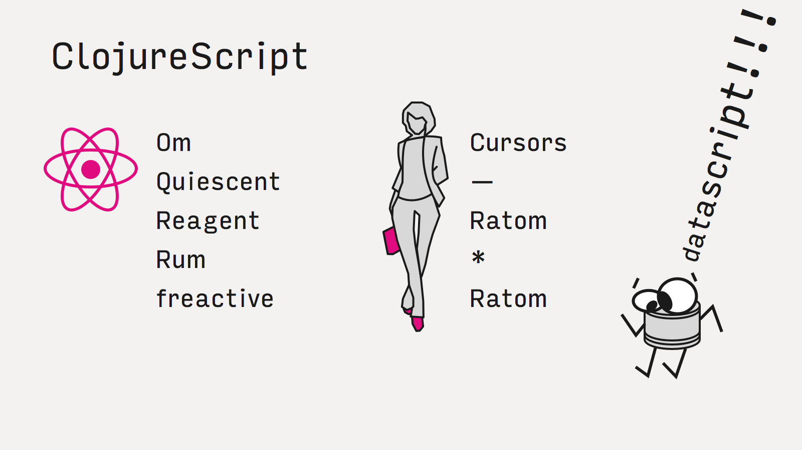

На Om построены последняя версия <a href="http://blog.getprismatic.com/om-sweet-om-high-functional-frontend-engineering-with-clojurescript-and-react/">Prismatic-а</a>, персонализированного агрегатора новостей:

<a href="https://circleci.com/">Circle.ci</a>, continous integration:

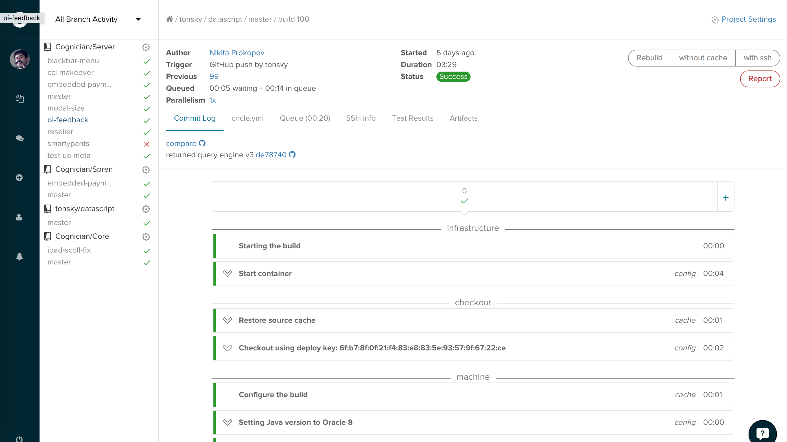

<a href="https://precursorapp.com/">Precursor</a>, инструмент для легковесного прототипирования UI (первую версию ребята собрали за 2 дня на хакатоне):

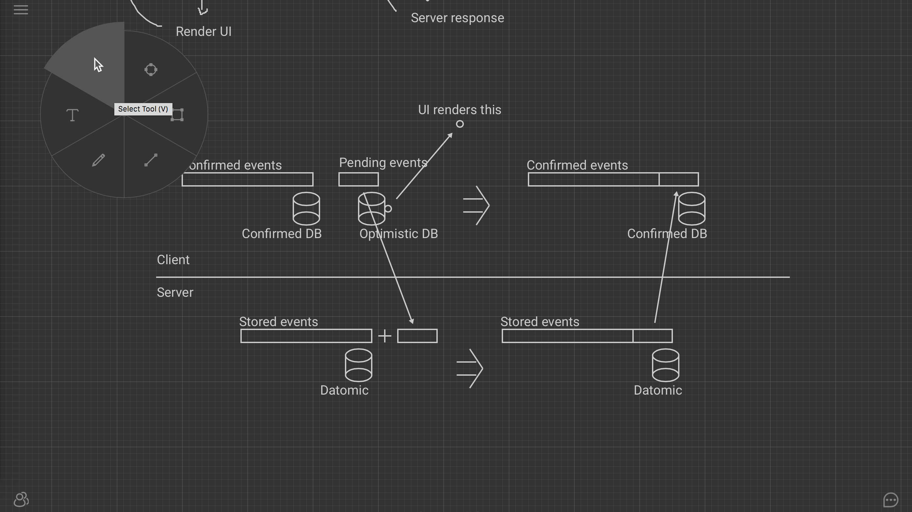

и <a href="https://github.com/jackschaedler/goya">Goya</a>, пиксельный редактор:

Во всех случаях разработчики поют дифирамбы простоте разработки и низковисящим фруктам, о которых мы говорили.

Вторая реализация это язык Elm. Это диалект Хаскеля, разработанный специально под подобную архитектуру приложений — по-другому там практически и не получится ничего сделать. Помимо перечисленного, у них еще есть явная работа с событиями в духе FRP. Практические применения мне неизвестны, но выглядит это наиболее живо из всей остальной compile-to-js функциональщины.

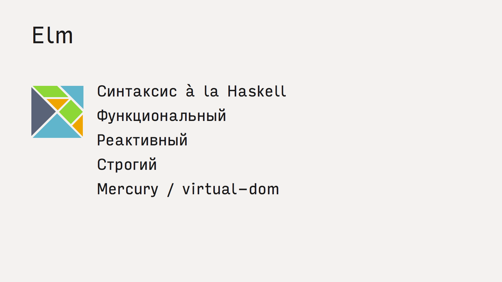

Наконец, все то же самое можно делать и на простом js. Ребята из React команды подхватили идею Om и сделали библиотеку immutable.js с персистентными структурами — теперь все то же самое можно собрать и на vanilla.js (естественно, со всеми недостатками джаваскрипта — легким порогом вхождения, большим количеством доступных разработчиков, прекрасным тулингом, переносимостью и т.п.)

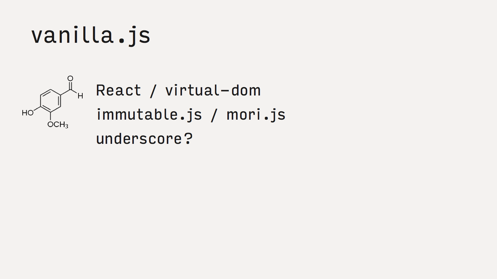

Еще раз подчеркну, что выбор языка в данном случае мне кажется вещью третьестепенной важности. Скажем, на различие в качестве/скорости разработки/производительности язык может повлиять на 10%, а правильная архитектура — на 90%.

## Итого

Использование идей функционального программирования открывает интересные возможности для клиентских архитектур. Такие приложения легче делать, отлаживать, поддерживать, за счет подхода они получаются более качественными и надежными, а многие вещи даются почти бесплатно. В ближайшем будущем более-менее все приложения как-то так будут выглядеть, а virtual dom стандартизуют и включат в браузер. Даже уже сейчас учить отдельный функциональный язык для этого необязательно. 

